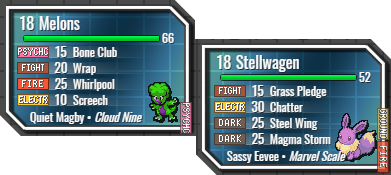
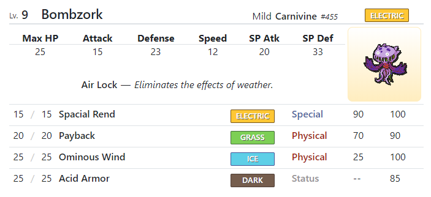
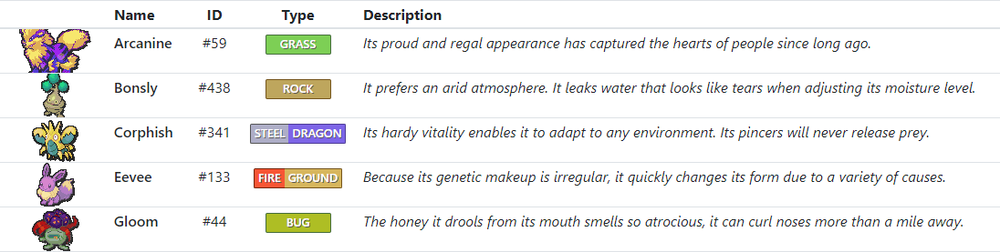
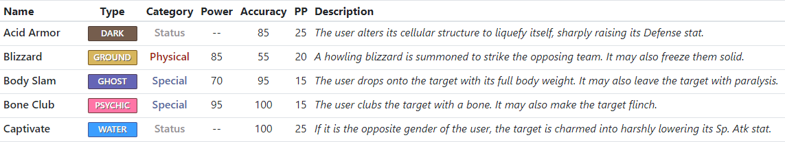

# Rando Pokédex

This project is a web app, with a complementary Lua script, that displays information about a playthrough of Pokémon Black or White. Importantly, it does so in a way that supports randomizer runs. Since every randomized ROM is different &mdash; different move stats, different types, and even different sprite graphics &mdash; we can't just pull from established data sources to get information about Pokemon and their moves. Instead, we read directly from memory to get the information we need, supplemented with screenshots (triggered manually but captured and processed automatically) to get sprite images and fill in the gaps.

The webapp provides a few different views as an end result. There's a customized stream overlay suitable for use as a Browser Source in OBS:



And there's also a web frontend that displays all the information that's collected so far. This includes a roster page, listing the details for all the Pokémon that have been captured:



...a Pokédex page, which lists an overview of all Pokémon and their types:



...and finally, a Moves page, which shows the randomized stats and types for all moves that captured Pokémon have learned.



The webapp uses a database to store this information persistently. It runs a worker thread that watches for screenshots and memory dumps from the accompanying Lua script: when new data is received, it's decrypted, parsed, and processed, the results are fed into the webapp via an HTTP API, and the web pages update in real-time (via socket.io) to reflect the new information.

At time of writing, a working example can be seen here: https://rando-pokedex.herokuapp.com

## Caveats

Currently, the Lua script used to dump screenshots requires a custom build of DeSmuME that adds a Lua function for toggling display layers, so I wouldn't call this project ready for public consumption.

Building the frontend _(which is optional, since bundled Javascript is versioned in `static/dist`)_ requires NodeJS. Install NodeJS and npm, and then you should be able to run `npm run build` from the root directory.

Running the server requires Python 3.6.8 and Pipenv. Install Python, then run `pip install --user pipenv` to get Pipenv, and then you should be able to run `pipenv install` and `pipenv run pokeserver` from the root directory. `http://localhost:5000` should bring up the web frontend, and `http://localhost:5000/hud` will display an overlay suitable for use in OBS via a Browser Source.

The server can run locally (for lightning-fast updates to the OBS overlay) while also updating a remote copy hosted on the internet so that viewers can see stats in real-time. At the moment this is accomplished in a very hacky way: the local instance simply forwards all API update requests to a remote mirror, and simple validation is performed with a secret API key. This configuration probably deserves some rethinking. Also, the SocketIO setup that drives real-time updates of all the frontend pages is not particularly robust in real-world, open-internet conditions, so sometimes the remote mirror needs to be manually reloaded to refetch missing data.

The Lua script run by DeSmuME simply dumps memory and screenshots to disk. The accompanying Python code in `python/pokedata` implements all the decryption, parsing, and image processing required to suss out the data that's relevant to this application. The application itself is a Flask app that stores Pokemon and move information in a database, and that serves up a React-based frontend to display that data to users. Parsing of memory dumps and screenshots takes place in a worker greenthread, which communicates new data to the webapp via an HTTP API.

## DeSmuME modification

This `git diff` output describes the changes made to DeSmuME to add the `gui.setlayermask` function, which allows this project's Lua script to procedurally toggle display layers before taking screenshots. Note that this change is only supported in the Windows version of DeSmuME, since each platform has an entirely separate codebase for its GUI frontend, and display layers visibility is tightly coupled to the frontend.

```diff
diff --git desmume/src/frontend/windows/display.cpp desmume/src/frontend/windows/display.cpp
index a538bb3..ce5c04d 100644
--- desmume/src/frontend/windows/display.cpp
+++ desmume/src/frontend/windows/display.cpp
@@ -968,3 +968,28 @@ void TwiddleLayer(UINT ctlid, int core, int layer)
    gpu->SetLayerEnableState(layer, newLayerState);
    MainWindow->checkMenu(ctlid, newLayerState);
 }
+
+void SetLayerMasks(int mainEngineMask, int subEngineMask)
+{
+   static const size_t numCores = sizeof(CommonSettings.dispLayers) / sizeof(CommonSettings.dispLayers[0]);
+   static const size_t numLayers = sizeof(CommonSettings.dispLayers[0]) / sizeof(CommonSettings.dispLayers[0][0]);
+   static const UINT ctlids[numCores][numLayers] = {
+       {IDM_MBG0, IDM_MBG1, IDM_MBG2, IDM_MBG3, IDM_MOBJ},
+       {IDM_SBG0, IDM_SBG1, IDM_SBG2, IDM_SBG3, IDM_SOBJ},
+   };
+
+   for (int core = 0; core < 2; core++)
+   {
+       GPUEngineBase *gpu = (GPUEngineID)core == GPUEngineID_Main ? (GPUEngineBase *)GPU->GetEngineMain() : (GPUEngineBase *)GPU->GetEngineSub();
+       const int mask = core == 0 ? mainEngineMask : subEngineMask;
+       for (size_t layer = 0; layer < numLayers; layer++)
+       {
+           const bool newLayerState = (mask >> layer) & 0x01 != 0;
+           if (newLayerState != CommonSettings.dispLayers[core][layer])
+           {
+               gpu->SetLayerEnableState(layer, newLayerState);
+               MainWindow->checkMenu(ctlids[core][layer], newLayerState);
+           }
+       }
+   }
+}
diff --git desmume/src/frontend/windows/display.h desmume/src/frontend/windows/display.h
index ea3662b..1c099c0 100644
--- desmume/src/frontend/windows/display.h
+++ desmume/src/frontend/windows/display.h
@@ -105,5 +105,6 @@ FORCEINLINE void ServiceDisplayThreadInvocations()
 
 void UpdateWndRects(HWND hwnd, RECT* newClientRect = NULL);
 void TwiddleLayer(UINT ctlid, int core, int layer);
+void SetLayerMasks(int mainEngineMask, int subEngineMask);
 
 #endif
\ No newline at end of file
diff --git desmume/src/lua-engine.cpp desmume/src/lua-engine.cpp
index a75fdbe..9252711 100644
--- desmume/src/lua-engine.cpp
+++ desmume/src/lua-engine.cpp
@@ -28,6 +28,7 @@
    #include "frontend/windows/main.h"
    #include "frontend/windows/video.h"
    #include "frontend/windows/resource.h"
+   #include "frontend/windows/display.h"
 #else
    // TODO: define appropriate types for menu
    typedef void* PlatformMenu;
@@ -3278,6 +3279,20 @@ DEFINE_LUA_FUNCTION(gui_settransparency, "transparency_4_to_0")
    return 0;
 }
 
+// gui.setlayermask(int top, int bottom)
+// enables or disables display layers for each screen according to the bitfields provided
+// e.g. 31 (11111) shows all layers; 0 (00000) hides all layers; 16 (10000) shows only the object layer (layer 4)
+// this function is only supported by the windows frontend.
+DEFINE_LUA_FUNCTION(gui_setlayermask, "top,bottom")
+{
+#if defined(WIN32)
+   lua_Integer top = luaL_checkint(L, 1);
+   lua_Integer bottom = luaL_checkint(L, 2);
+   SetLayerMasks(top, bottom);
+#endif
+   return 0;
+}
+
 // takes a screenshot and returns it in gdstr format
 // example: gd.createFromGdStr(gui.gdscreenshot()):png("outputimage.png")
 DEFINE_LUA_FUNCTION(gui_gdscreenshot, "[whichScreen='both']")
@@ -4861,6 +4876,7 @@ static const struct luaL_reg guilib [] =
    {"transparency", gui_settransparency},
    {"popup", gui_popup},
    {"parsecolor", gui_parsecolor},
+   {"setlayermask", gui_setlayermask},
    {"gdscreenshot", gui_gdscreenshot},
    {"gdoverlay", gui_gdoverlay},
    {"redraw", emu_redraw}, // some people might think of this as more of a GUI function

```

If you're comfortable making the changes yourself: clone the DeSmuME source, make the listed changes to `display.h`, `display.cpp`, and `lua-engine.cpp`, then build in Release configuration from `src/frontend/windows/DeSmuME.sln` and use the executable in `src/frontend/windows/__bins`.
